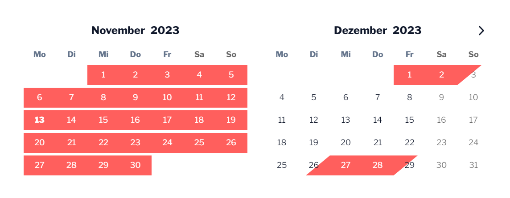

# Wordpress Airbnb ICal Calendar Plugin 📆

A simple wordpress plugin to add a occupancy calendar for your airbnb to your page.

[]

## Special features 🚀

Avoids too many request to your airbnb ical. Creates a local copy of the current occupancy. The cached copy is kept a maximum of 60 seconds.

## How to use 💡

1. Copy the subfolder ```airbnb-ical-calendar``` into your wordpress plugin folder ```wp-content/plugins```.
2. Copy the ical url from your airbnb, as descibed here: https://www.airbnb.de/help/article/99
3. Insert the following shotcode on your page/blogpost, change it with your ical url and modify the other parameters.
```
[airbnb_ical_calender ical="https://www.airbnb.de/calendar/ical/12345678.ics?s=xyz" months="3" allowSelection="true"]
```

## Third-party libraries 🙏

### PHP ICS Parser

[u01jmg3/ics-parser](https://github.com/u01jmg3/ics-parser)

### Vanilla Calendar

[uvarov-frontend/vanilla-calendar](https://github.com/uvarov-frontend/vanilla-calendar)